# 利用Agent实现自己的AI炒股小助手
最近在github上发现了一个开源的金融炒股Agent项目，感觉这个项目比较有意思，因此深入了解了一下。

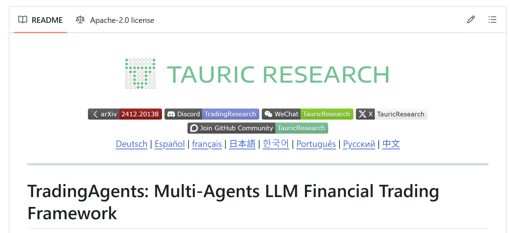

这个项目本质上就是通过多个Agent进行互相协同，然后有几个不同的角色进行共同制定，分析一个股票是否可以持有、买入或者卖出。

但是这个项目有个缺点在于，它需要用到GPT-4o的缘故，但是众所周知，国内很难调用到GPT-4o的API，因此需要对这个项目进行一定的改进。我这里用到的是DeepSeek API，因为它便宜且充值方便。但还有一个问题是因为DeepSeek官方的API是没有联网功能的，所以这里另辟蹊径，用了另一种方法来进行实现。

首先先来简单介绍一个这个项目把，然后再设置一下一些API即可以重新使用这个项目了。

# 项目介绍
近年来，基于大语言模型（LLM）的多智能体系统在不同领域上都取得了明显的进展。但在股票交易市场中，还存在几个问题：
- **缺乏真实组织结构建模**，只能处理单一任务或独立收集数据，难以模拟真实交易公司内部的协作流程。
- **通信接口效率低下**，主要依赖自然语言对话，信息易在多轮交互中丢失从而导致后面的LLM不能获取到信息，导致失败

因此项目中提出了TradingAgents，通过多Agent模拟交易所内部协作流程的多智能体框架，并通过结构化与自然语言相结合的混合通信协议提升信息传递效率。

它的主要贡献有：
- **打造了一个真是的组织结构场景**：框架中定义了七类专职智能体，包括基础面分析师、情绪/新闻分析师、技术分析师、研究员（多轮“多空”辩论）、交易员（不同风险偏好）、风控团队和基金经理，全面覆盖真实交易团队的分工与协作 。
- **多角色、多模型协同**：根据任务复杂度动态选用“快思考”模型（如 gpt-4o-mini 用于数据检索、表格转换）与“深思考”模型（如 o1-preview 用于推理密集型决策），平衡效率与推理深度 。
- **股票实测效果明显**：在回测实验中，TradingAgents 在累积收益、Sharpe 比率、最大回撤等关键指标上显著优于 Buy-&-Hold、MACD、KDJ+RSI、ZMR、SMA 等五种基线策略 。

如下图所示，整体架构中构建了多种不同的Agent进行协同操作。

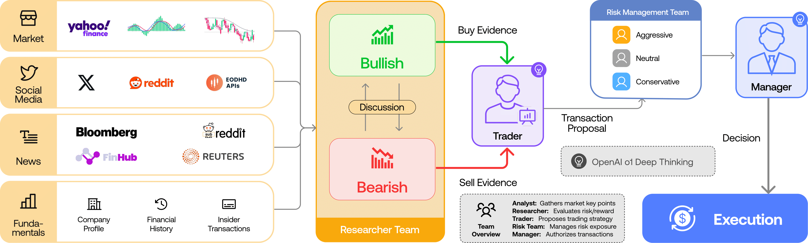

分析师团队（Analyst Team）：包括了以下四种方面，他们并行收集并输出结构化研究报告，为后续决策提供数据支撑。

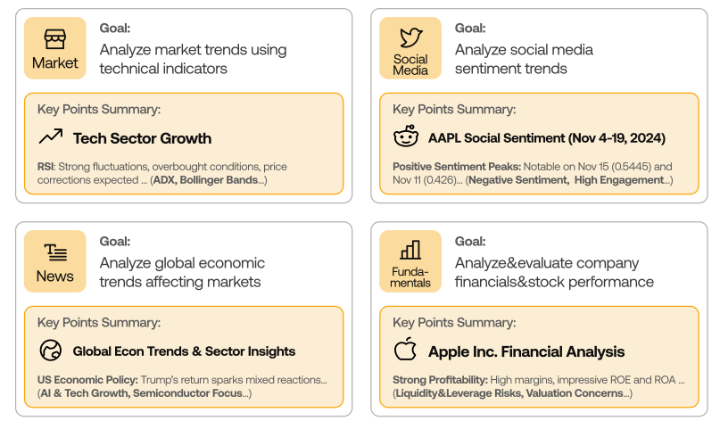

- 基础面分析师（Fundamentals Analyst）
- 情绪/社交媒体分析师（Sentiment Analyst）
- 新闻/宏观分析师（News Analyst）
- 技术面分析师（Technical Analyst）

**研究员团队**（Researcher Team）：为了模仿市场上的多头和空头辩论。

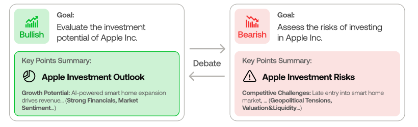

- 多轮“多头（Bullish）” vs. “空头（Bearish）”辩论，评估投资机会和潜在风险，最后由辩论协调者（Facilitator）选定观点。

**交易员团队**（Trader Agents）：基于分析师与研究员的综合报告，决定建仓/平仓时机与规模，并生成解释性报告。

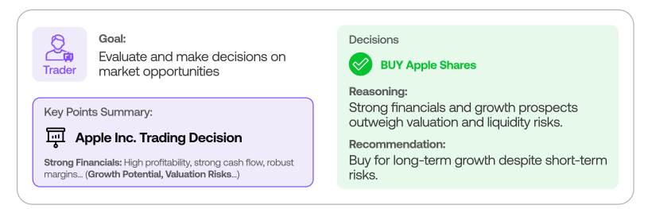

**风控团队**（Risk Management Team）：从冒险、中性、保守三种风险视角进行多轮讨论，提出风险对冲或头寸调整建议，确保组合符合风险容忍度 。

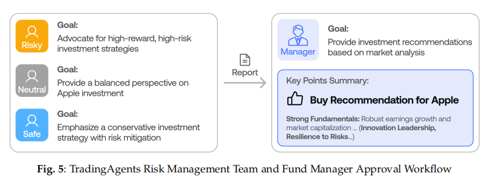

**基金经理**（Fund Manager）：审核风控建议并最终执行交易，闭环整个流程。

整体主干模型架构中，使用的是推理大模型o1，保证了推深度和逻辑严密性。数据检索、报告生成等任务使用“快思考”模型（gpt-4o-mini / gpt-4o），提高效率与吞吐量。支持无GPU部署，仅依赖 API 调用，且可灵活替换为本地或其他 API 模型，具备良好的可扩展性与未来可升级性 。

其实从上面就可以看到，这个Agent主要就是设置了多个角色，每个角色负责不同的分工，

# 前置安装
这个Agent需要调用多个API，比如金融API、OpenAI模型API、豆包模型的API等。如果是在国内，我们可以直接用DeepSeek模型API。


什么是API Key？
- **API Key**是开发者在调用第三方服务（如OpenAI、百度地图、阿里云API等）时，平台分配给你的 **唯一标识凭证。**
- 它类似于账号密码，用于验证调用者的身份，追踪调用次数，防止滥用。

**1）开通DeepSeek官网的API Key**
这里面由于我们是在国内，比较难使用OpenAI的模型，因此我们可以使用国内的DeepSeek进行替换。而且DeepSeek很便宜，充值个10块钱就可以用很久了~

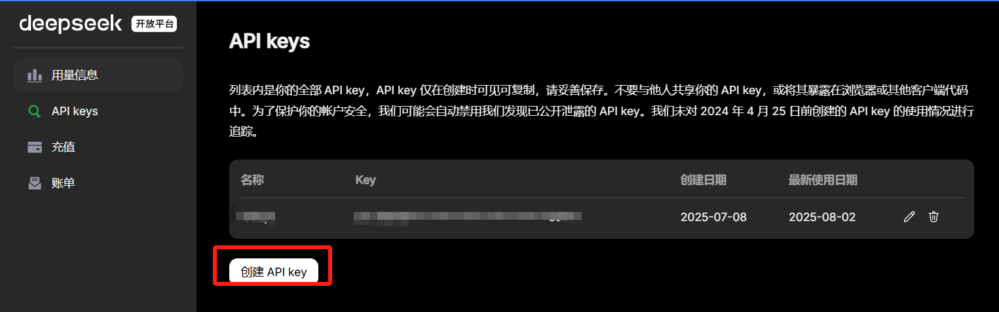

然后记录这个API key

**2）开通火山引擎API服务**
为什么要开通火山引擎API，这是因为原生的DeepSeek API它是不会调用互联网搜索工具，所以需要借助这个平台来让DeepSeek得到联网功能。

原来的代码其实是没有接入DeepSeek的联网功能，所以我这里做了一些改进。在代码中借助火山平台来达到这个联网目的。

首先先开通火山引擎的API Key，去到官网申请一个账号，然后点击创建就可以了。记得也需要记录一下这个API key

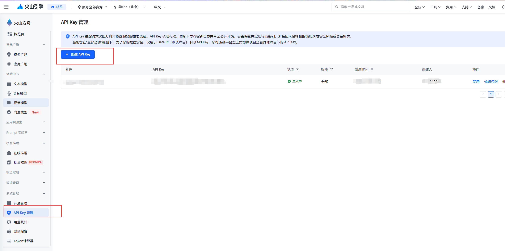

然后开启向量大模型，主要用来对文本进行分块和做成embedding进行有效分析。

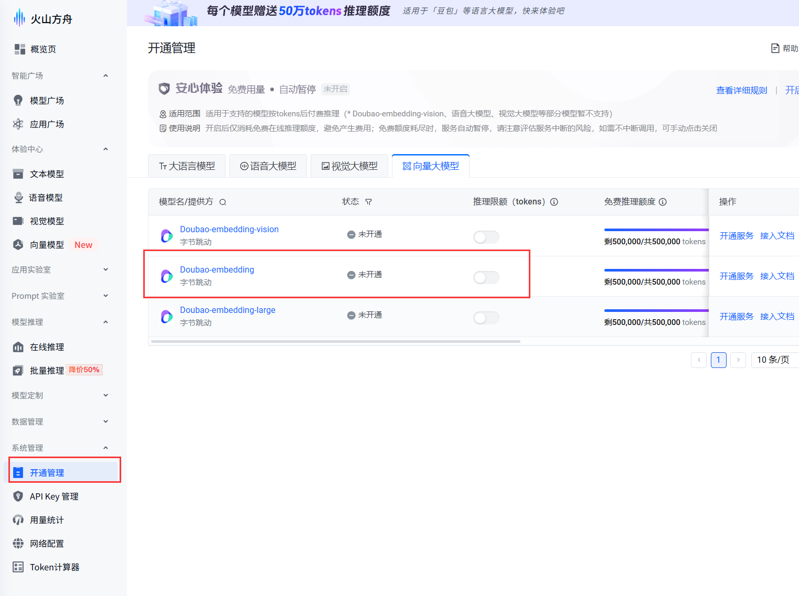

**3）开通R1联网功能**
由于需要用到R1的联网功能，但是本身如果直接调用DeepSeek官网的API，其实是不能够进行联网搜索的。因此这里用到火山的联网能力，间接使得R1也可以联网。

首先去到火山引擎官网，开通一下DeepSeek

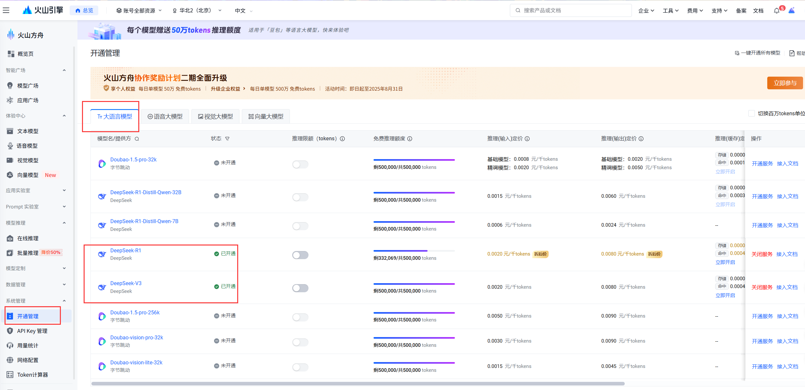

然后点击创建我的应用

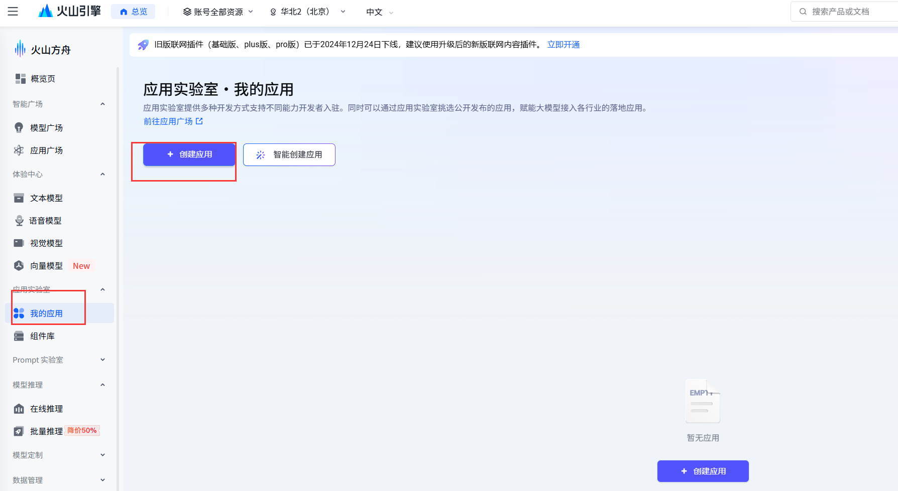

构建R1联网接口

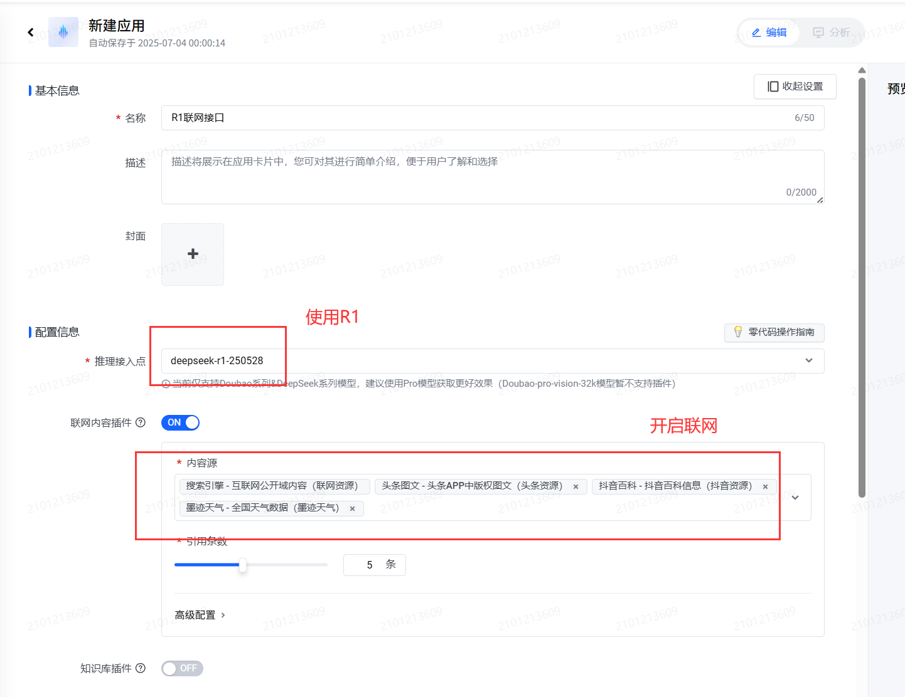

最后点击发布，既可以使得火山引擎的API Key具备了R1的联网搜索功能。


# 运行股票分析AI助手
首先安装相应的环境：
```plaintext
conda create -n tradingagents python=3.13
conda activate tradingagents
pip install -r requirements.txt
```

然后把刚刚得到的API输入到环境中：
```plaintext
export DEEPSEEK_API_KEY=Deepseek的API
export VOLCES_API_KEY=火山的API
```

运行程序命令：
```plaintext
streamlit run app.py
```

就会得到下面的运行界面了

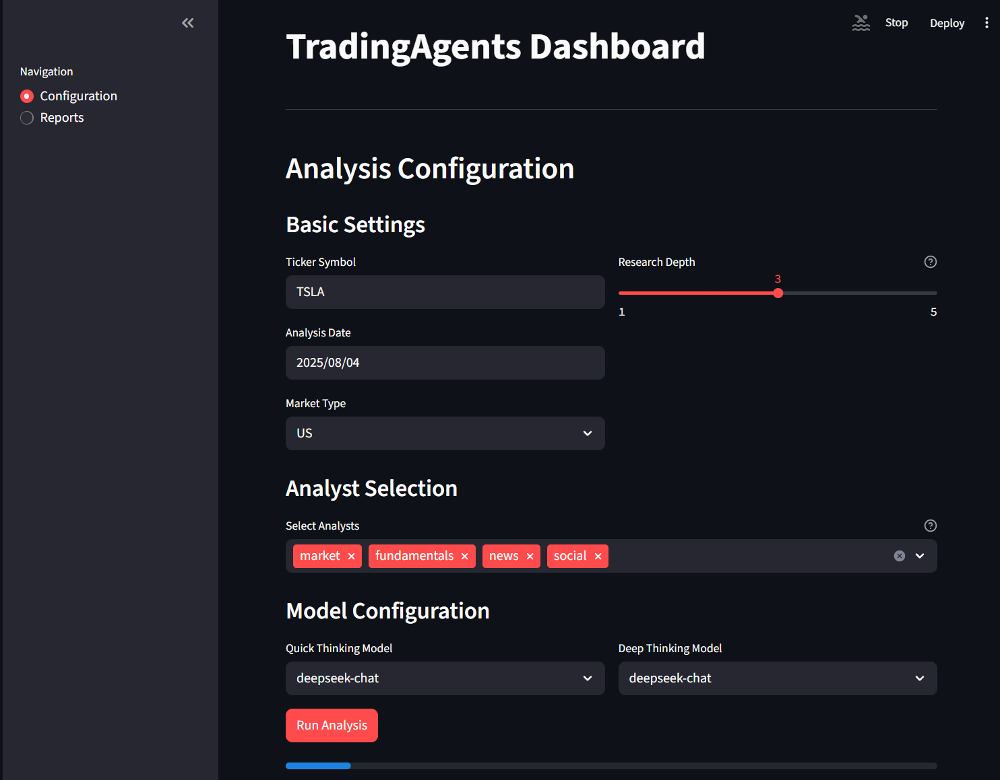

输入股票代码，比如我这里输入的是美股TSLA的股票代码，然后选择需要进行什么分析。这里面有四个可以选择：
- market：金融市场相关信息
- fundamentals：该公司信息
- news：相关新闻
- social：市场情绪

最后点击“Run Analysis”，等待一定的时间就可以了~在导航栏的第二页可以找到具体的生成报告

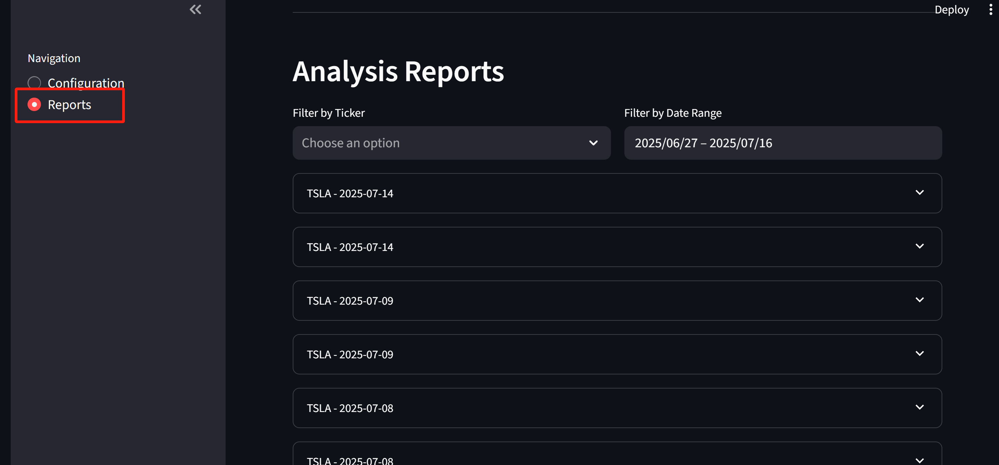

最后可以看看我这边生成的效果，我这里是针对TSLA这个股票做了分析。

首先它拉取了TSLA最近的股价信息，作为市场分析：


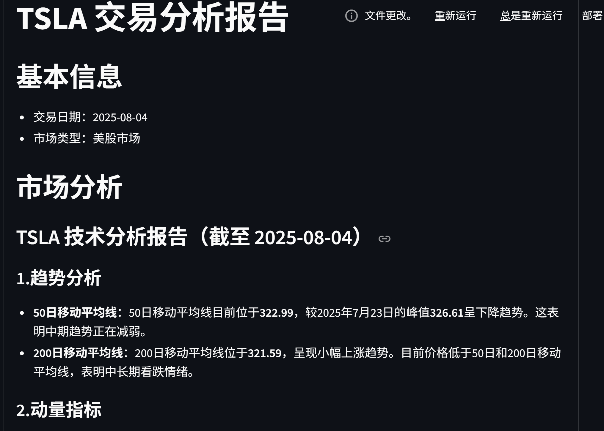

它会更具不同的指标给出具体的结论：

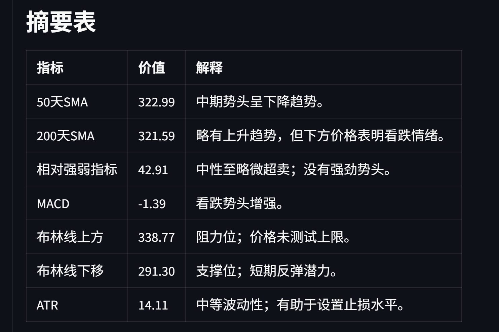

接下来是基本面分析，收入增长：第二季度收入225亿美元，同比增长12%，主要因收入需求疲软和税收抵免政策同比增长。盈利能力：毛利率降低18%（去年同期为22%），净利率受到赔偿额外拖沓。

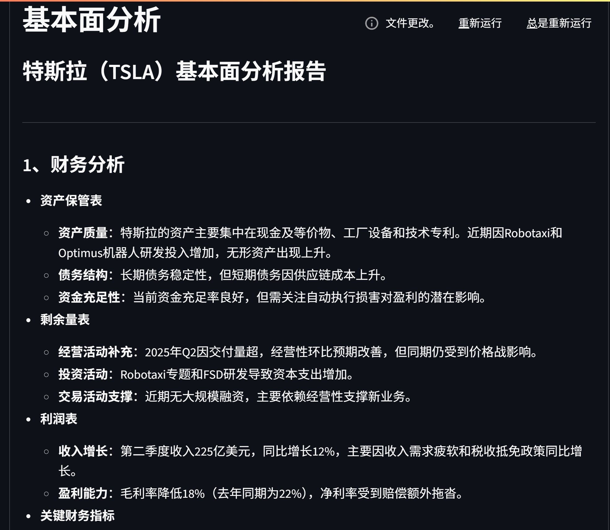

再然后分析其公司的相关新闻，短期（1-3个月）关注Cybertruck产能爬坡进度和美联储降息预期，若数据积极可能突破当前震荡区间。

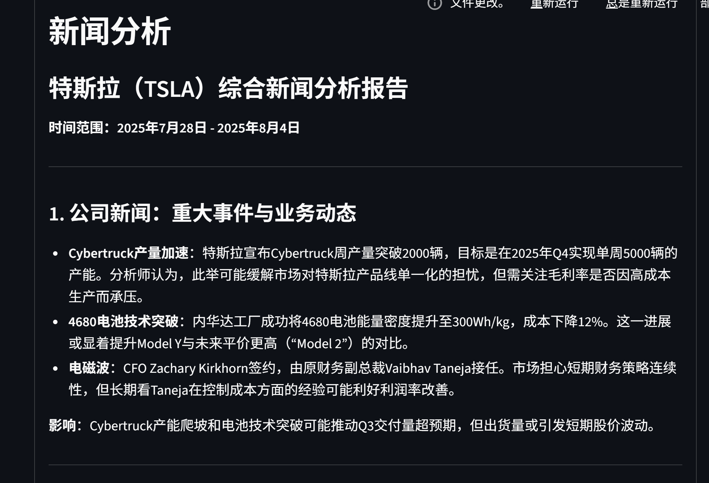

接着它构建了多个Agent进行相关的辩论，主要有激进派、保守派和中立派。
- 激进派：4680电池技术垄断（300Wh/kg），Dojo AI估值800亿美元，有一定的政策红利（美国锂矿）
- 保守派：真实毛利率16.5%且下滑，自由现金流-18亿美元，中国市场竞争恶化（比亚迪成本低15%）
- 中立派：技术潜力存在但执行风险高，需对冲策略（如配对交易）

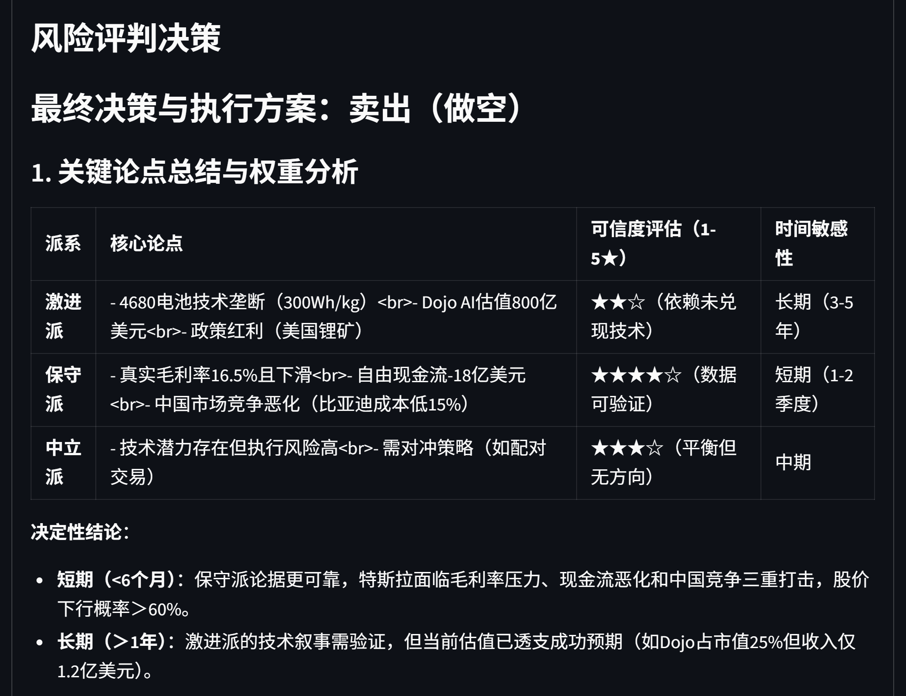

根据上面的所有结论，它给出了最后的交易逻辑是“卖出”

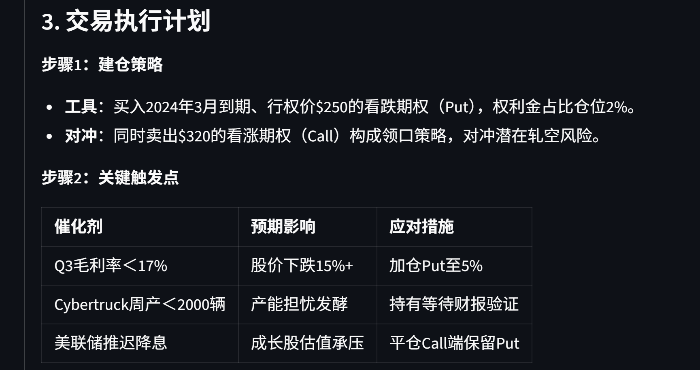

好了，以上就是我重新构建的金融投资AI助手。感兴趣的可以关注我的公众号“算法一只狗”，然后发送“股票”两个字，即可获取全套代码。


# 写在最后
当然，股市有风险，投资需谨慎。再好用得AI助手分析，也只是帮助你减少更多的个人情绪，让你再股市中有辅助工具去进行投资。

它无法替代你的判断与决策。最终的投资选择仍需基于你自身的风险承受能力、财务目标和对市场的理解。理性看待AI的建议，将其作为参考而非指令，才能在波动的市场中保持清醒，做出更稳健的选择。记住，工具的价值在于辅助，而非主导。